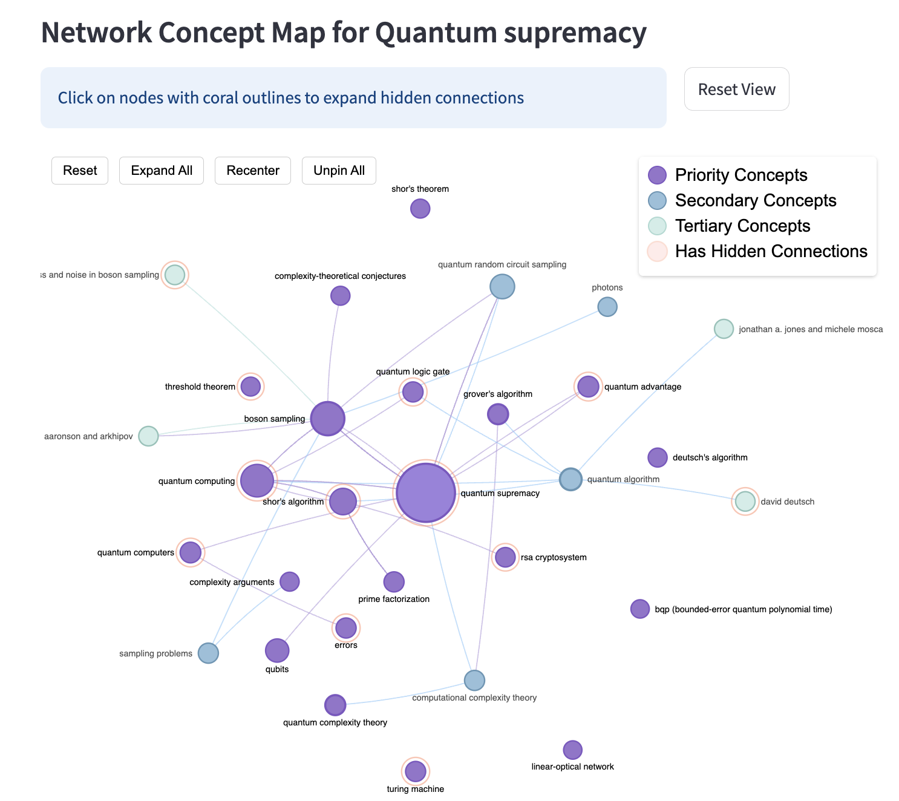

# Cognitext: Enhanced Concept Map Generator

Cognitext is an interactive application that transforms Wikipedia articles into explorable concept maps, making complex information more accessible through visual knowledge representation. The tool extracts key concepts and their relationships, then organizes them into an interactive network that helps users understand connections between ideas without requiring linear reading.



## Features

- **Interactive Network Visualization**: Explore knowledge through an intuitive, force-directed graph layout
- **Layered Concept Organization**: Concepts are organized into priority, secondary, and tertiary layers
- **Visual Encoding**:
  - **Node sizes** represent concept importance (based on frequency and total connections)
  - **Color coding** distinguishes between concept layers
  - **Glowing nodes** indicate hidden connections to secondary or tertiary concepts
- **Progressive Disclosure**: Start with essential concepts and progressively reveal deeper connections
- **Contextual Chat Interface**: Ask questions about the content and get AI-powered responses
- **Multiple Processing Modes**: Process articles by section for different levels of detail

## Getting Started

### Prerequisites

- Python 3.8 or higher
- An OpenAI API key (required for concept extraction and chat functionality)

### Installation

1. Clone the repository:
   ```bash
   git clone https://github.com/mollyhan19/simplified-cognitext
   cd simplified-cognitext
   ```

2. Install dependencies:
   ```bash
   pip install -r requirements.txt
   ```

3. Set up environment variables:
   - Create a `.env` file in the project root
   - Add your OpenAI API key: `OPENAI_API_KEY=your_api_key_here`

### Running the Application

Launch the Streamlit app:
```bash
streamlit run python/app.py
```

This will start a local web server and open the application in your default browser.

## Using the Application

### API Key Configuration

1. Enter your OpenAI API key in the sidebar
2. Click "Validate and Save API Key"
3. Once validated, you'll have full access to the application features

### Exploring Pre-generated Concept Maps

1. Navigate to the "Pre-generated Concept Maps" tab
2. Select a topic from the dropdown menu (options include Microchimerism, Quantum Supremacy, Grammaticalization, and P versus NP Problem)
3. Click "Load Pre-generated Concept Map"

### Creating Custom Concept Maps

1. Navigate to the "Generate Your Own" tab
2. Enter a Wikipedia URL
3. Select processing options:
   - Processing Mode: Choose how the article is processed (section)
   - Map Type: Select the visualization structure (Network)
4. Click "Generate from Wikipedia"
5. Wait for processing to complete (may take 5-10 minutes depending on article length)

### Exploring the Concept Map

The visualization is designed for interactive exploration:

1. **Overview**: Start with priority concepts (larger nodes) to understand main ideas
2. **Node Interaction**:
   - **Left-click** on a node to focus on it and its connections
   - **Right-click** on a node to view its detailed explanation
   - **Click on glowing nodes** (with coral outlines) to expand hidden connections
   - **Drag nodes** to rearrange the visualization
3. **Link Interaction**: Hover over connections to see relationship details and evidence
4. **Controls**:
   - Use the toolbar at the top for resetting, expanding all nodes, recentering, and unpinning
   - Zoom with mouse wheel or trackpad gestures
   - Click on empty space to reset focus

### Using the Concept Chatbot

The right panel contains an AI chatbot that can answer questions about the loaded concept map:

1. Type your question in the chat input
2. Receive AI-generated responses based on the concept map content
3. Ask about specific concepts or relationships for detailed explanations
4. Use the "Clear Chat History" button to reset the conversation

## Tips for Effective Exploration

1. Begin with high-priority concepts (larger nodes) to understand the main framework before diving into details
2. Pay attention to relationship types between concepts, which reveal how ideas connect
3. Use the chatbot to ask for clarification on complex topics or to summarize sections
4. Look for clusters of related concepts, which often represent important subtopics
5. Expand glowing nodes to discover hidden knowledge territories
6. Drag nodes to create more space in crowded areas for better readability
7. Download the HTML file to share or explore the map locally

## Technical Details

The application uses:

- Streamlit for the web interface
- OpenAI's API (GPT-4) for concept extraction and chatbot functionality
- all-MiniLM-L6-v2 transformer model for pruning
- D3.js for interactive network visualization
- Wikipedia API for article content retrieval

## Limitations

- Processing new Wikipedia articles requires an OpenAI API key and will incur usage charges
- Very long or complex articles may take 5-10 minutes to process
- The visualization may become crowded with very large concept networks


## Acknowledgments

- This project builds on research in concept mapping, knowledge visualization, and educational technology
- Special thanks to Emory NLP lab, and Dr. Jinho Choi
